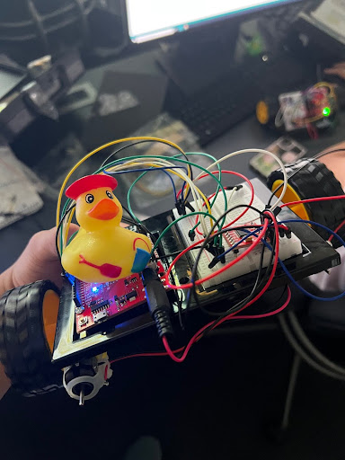

# Maze_Robot

This project contains Arduino code for a robot designed to navigate a maze. Developed as part of a project at UPenn in 2023, it includes multiple example codes and experiments for robotics and sensor integration.

  

## Project Structure

- **src/ARDUINO.ino**: Main Arduino sketch for the maze robot.
- **src/firstarduinocodes/**: Early experiments and motor control code.
- **src/redbotcode/**: Code for RedBot robot platform, including line following and obstacle avoidance.
- **src/simonsays.ard/**: Simon Says game code (SparkFun Inventor’s Kit example).
- **src/arduinocodes.zip**: Archive of additional/legacy Arduino codes (not needed for most users).

## Getting Started

1. Open the desired `.ino` file in the Arduino IDE.
2. Connect your Arduino-compatible robot hardware.
3. Upload the code to your board.
4. Follow the comments in each file for wiring and usage instructions.

## Requirements
- Arduino IDE (https://www.arduino.cc/en/software)
- Supported Arduino board (e.g., Uno, RedBot, etc.)
- Basic electronic components (motors, sensors, LEDs, etc.)

## Notes
- The `arduinocodes.zip` file is for archival purposes and is not required for normal use.
- Each subfolder contains code for different experiments or robot platforms.
- See comments at the top of each `.ino` file for wiring and usage details.

## Contributing
Pull requests are welcome! For major changes, please open an issue first to discuss what you would like to change.

## License
This project is licensed under the MIT License. See the LICENSE file for details.
